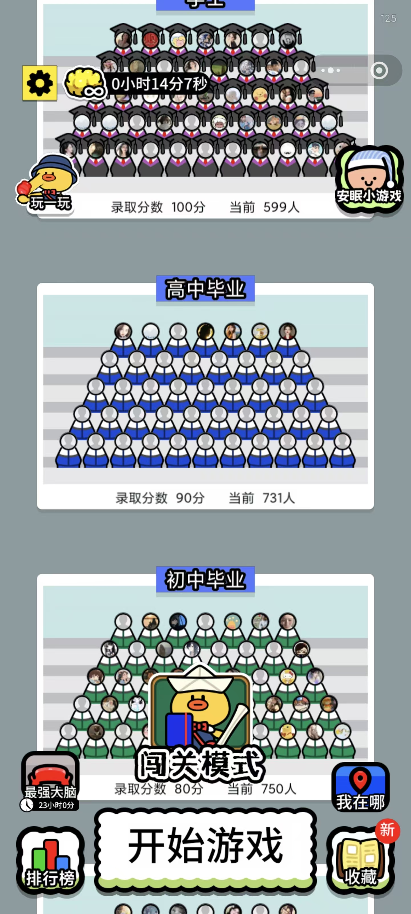
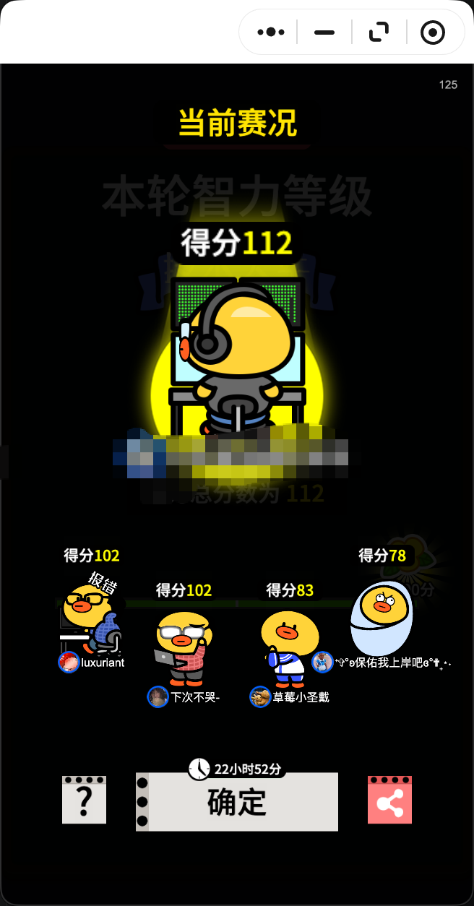
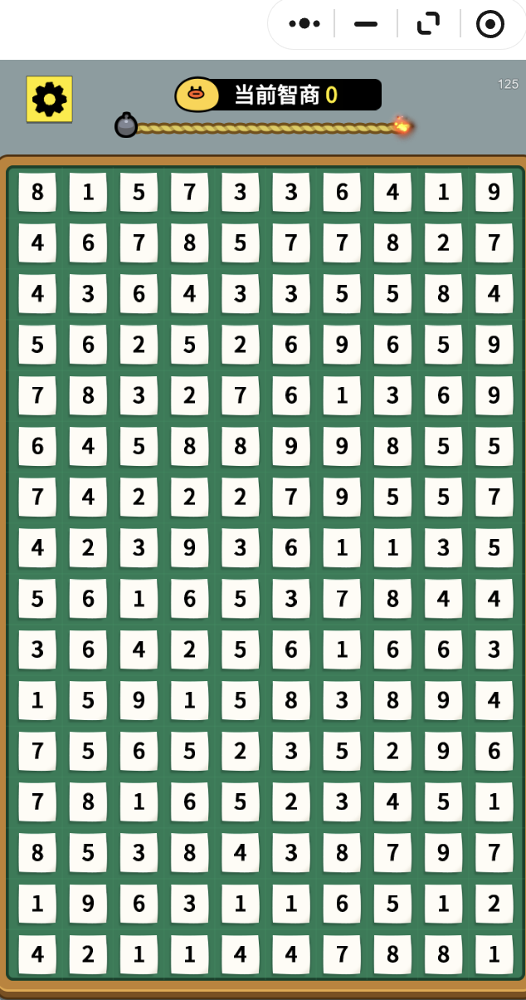

# 微信小游戏开局托儿所自动解题工具（Mac）

## 项目说明

本项目用于自动完成微信小游戏 **开局托儿所** 的“和为10框选消除”玩法。  
核心流程是“模型识别 + 本地求解 + 自动框选”，并且支持无解重识别、计分统计、日志输出和静态题面测试。

## 免费声明与安全提示

- 本程序完全免费，仅用于个人学习与技术研究。
- 任何个人/第三方基于本源码修改后进行二次收费、代刷等行为，均与作者本人无关。
- 请务必注意保护个人隐私与账号安全。
- 使用本程序可能带来包括但不限于封号、清零分、功能限制等风险，相关后果需自行承担。

这个脚本会循环执行：
1. 截图棋盘
2. 识别每个格子的数字（OCR）
3. 找到“矩形和=10”的目标区域
4. 自动拖拽框选

## 游戏截图（开局托儿所）

游戏界面截图：



UI 截图：

<p>
  
  
</p>

## 效果展示

在 `test.txt` 上本地求解测试通过，示例输出：

```text
backend=local
best=(0,4)->(1,5) area=4 sum=10 score=1.000 points=4
```

含义：
- 找到和为 10 的最优框选
- 本次消除得分 `points=4`（每消除 1 个数字 +1 分）

## 1) 环境安装（统一在 `wx-game`）

```bash
cd /Users/yelainab/project/wx_game
conda create -n wx-game python=3.11 -y
conda activate wx-game
pip install -r requirements.txt
```

安装 tesseract（仅在 `--ocr-backend tesseract` 时需要）：

```bash
brew install tesseract
```

如果 `conda activate` 不生效：

```bash
conda init zsh
```

然后重开终端。

## 2) 配置模型（写在代码里）

编辑 [auto_solver.py](/Users/yelainab/project/wx_game/auto_solver.py) 顶部 `LLM API Config (edit here)`：

- `MIMO_BASE_URL`：MiMo OpenAI 兼容地址
- `MIMO_API_KEY`：MiMo key
- `OPENAI_API_KEY`：仅 `--llm-provider openai` 时需要
- `MIMO_VISION_MODEL`：模型识别图片时用的视觉模型（默认 `mimo-v2.5`）

## 3) macOS 权限

到 `系统设置 -> 隐私与安全性`，给运行终端（Terminal/iTerm）开启：
- 屏幕录制
- 辅助功能

否则脚本不能截图或拖拽鼠标。

## 4) 启动方式

```bash
conda activate wx-game
python auto_solver.py --rows 16 --cols 10
```

首次运行会提示你手动定位棋盘：
- 鼠标移到数字区左上角，回车
- 鼠标移到数字区右下角，回车

## 5) 推荐模式

模型识别 + 本地求解（当前推荐）：

```bash
python auto_solver.py --rows 16 --cols 10 --ocr-backend model --solver-backend local
```

说明：该模式由 MiMo 负责识别数字，本地算法负责找和为10的最优框选，稳定性更高。

每 `N` 轮才模型识别一次（中间轮次本地推演）：

```bash
python auto_solver.py --rows 16 --cols 10 --ocr-backend model --solver-backend local --ocr-every-n 3
```

说明：`--ocr-every-n 3` 表示每 3 轮做一次 OCR，其他轮次复用上次识别结果并在本地把已消除区域标记为 `0`（空格）继续求解。后续允许横跨这些空格继续框选，只要框内总和仍为 `10`。

只识别一次（首轮 OCR，后续全本地推演）：

```bash
python auto_solver.py --rows 16 --cols 10 --ocr-backend model --solver-backend local --ocr-once
```

识别一次后一直做题，直到无解再重新识别（循环）：

```bash
python auto_solver.py --rows 16 --cols 10 --ocr-backend model --solver-backend local --ocr-once --reocr-on-no-solution
```

说明：当前逻辑是“推演无解时先重新识别一次；若重新识别后仍无解则停止”。

持续运行直到无解：

```bash
python auto_solver.py --rows 16 --cols 10 --ocr-backend model --solver-backend local
```

tesseract 识别 + 本地求解（离线求解）：

```bash
python auto_solver.py --rows 16 --cols 10 --ocr-backend tesseract --solver-backend local
```

只看识别与求解，不执行拖拽：

```bash
python auto_solver.py --rows 16 --cols 10 --dry-run
```

## 6) 参数说明

- `--rows` / `--cols`：棋盘行列数（默认 `16 x 10`）
- `--loops`：最大执行次数（默认 `0`，表示不限次数，直到无解）
- `--interval`：每轮间隔秒数
- `--dry-run`：只识别和求解，不拖拽
- `--log-file`：把运行日志追加写入文件
- `--drag-duration`：拖拽耗时（秒）
- `--mouse-settle`：拖拽前鼠标落点停顿秒数
- `--down-settle`：按下鼠标后停顿秒数
- `--drag-end-settle`：到达终点后松开前停顿秒数
- `--distance-settle-scale`：按拖拽距离额外增加停顿（秒/像素）
- `--edge-inset-ratio`：拖拽起止点内缩比例
- `--ocr-backend`：`model` 或 `tesseract`
- `--vision-model`：模型 OCR 的视觉模型名
- `--ocr-every-n`：每 N 轮做一次 OCR（默认 `1`，即每轮都识别）
- `--ocr-once`：只在第一轮 OCR 一次，后续仅本地推演
- `--reocr-on-no-solution`：当本地推演无解时，立即重新OCR并进入新一轮解题
- `--margin-ratio`：tesseract 单格裁剪边距比例
- `--min-cell-conf`：最小单格置信度阈值
- `--solver-backend`：`openai`（模型求解）或 `local`（本地求解）
- `--llm-provider`：`mimo` 或 `openai`
- `--openai-model`：模型求解使用的模型名
- `--model-max-candidates`：模型求解时最多返回的候选题解数量

## 7) 测试与效果（在 `wx-game`）

测试模型连通性：

```bash
conda run -n wx-game python -c "from openai import OpenAI; import auto_solver; c=OpenAI(api_key=auto_solver.MIMO_API_KEY, base_url=auto_solver.MIMO_BASE_URL); r=c.chat.completions.create(model='mimo-v2.5-pro', messages=[{'role':'user','content':'只回复OK'}], max_completion_tokens=16); print(r.choices[0].message.content)"
```

测试脚本使用说明：

```bash
conda run -n wx-game python test_txt_solver.py --file test.txt --solver-backend local --show-all --simulate-until-no-solution --log-file test_txt_solver.log
```

- `test_txt_solver.py`：针对 `test.txt` 这类静态矩阵做解题测试（本地/模型都可）。
- `test_solver_full_log.py`：输出更完整的调试日志（包含本地枚举和模型返回原始信息）。

常用命令：

```bash
# 本地求解 + 列出全部可行解 + 推演总分
conda run -n wx-game python test_txt_solver.py --file test.txt --solver-backend local --show-all --simulate-until-no-solution --log-file test_txt_solver.log

# 模型求解（对同一份 test.txt）
conda run -n wx-game python test_txt_solver.py --file test.txt --solver-backend model --llm-provider mimo --openai-model mimo-v2.5-pro --log-file test_txt_solver.log

# 完整调试日志（输出到文件）
conda run -n wx-game python test_solver_full_log.py > test_solver_full_log.out 2>&1
```

## 8) 紧急停止

脚本启用了 `pyautogui.FAILSAFE=True`。  
把鼠标迅速移到屏幕左上角可立即触发停止。

## 9) 常见问题

- `APIConnectionError`：网络或域名不可达，先检查 `MIMO_BASE_URL`、代理、DNS。
- `Model OCR returned empty text`：模型输出被截断或返回异常，已内置重试；可再提高 `max_completion_tokens`。
- 识别差：优先使用 `--ocr-backend model`；若用 tesseract，调 `--margin-ratio` 与 `--min-cell-conf`。
- 无解后行为：当前默认是“无解即停止”；若开启 `--reocr-on-no-solution`，会先强制重识别一次再判断。
- 使用 `--ocr-every-n > 1` 时若推演与真实棋盘偏差，会在下一次 OCR 自动纠正。
- 使用 `--ocr-once` 时不会自动纠正漂移，建议搭配较小 `--loops` 或先 `--dry-run` 验证。
- 当前代码已内置较稳的默认拖拽速度与停留参数（`drag-duration=0.16`、`mouse-settle=0.03`、`down-settle=0.03`、`drag-end-settle=0.05`、`distance-settle-scale=0.00015`）。
- 如需调整，请直接修改 [auto_solver.py](/Users/yelainab/project/wx_game/auto_solver.py) 中 `argparse` 默认值（`--drag-duration`、`--mouse-settle`、`--down-settle`、`--drag-end-settle`、`--distance-settle-scale`）。
- 安全建议：不要把真实 API Key 提交到代码中，建议只在本地私有文件中填写。

计分规则：每次消除时，矩形内每个正数格（`>0`）记 1 分，累计为 `total_points`，会实时打印在日志中。
